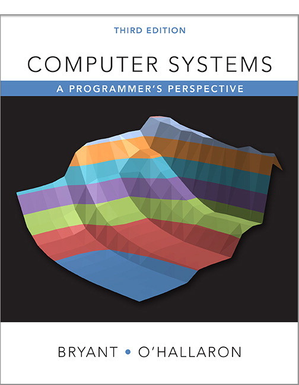

# CSAPP-3e-Solutions

**Computer Systems: A Programmer's Perspective Third Edition Solutions**

## issues

> Hurry makes faulty work and no improvement makes it disappointed.

Thanks every improvement makes the project better.

|issue|from |by|status|
|-----|-----|--|------|
|solution 2.84 seems to have a problem|[github issue#1](https://github.com/DreamAndDead/CSAPP-3e-Solutions/issues/1)|[littlecoke](https://github.com/littlecoke)|open|
|solution 9.16 seems to have a problem|[github issue#4](https://github.com/DreamAndDead/CSAPP-3e-Solutions/issues/4)|[upupming](https://github.com/upupming)|open|
|Problem 3.66|[github issue#5](https://github.com/DreamAndDead/CSAPP-3e-Solutions/issues/5)|[gonglinyuan](https://github.com/gonglinyuan)|open|
|solution 9.13|[disqus comment on 9.13](https://dreamanddead.gitbooks.io/csapp-3e-solutions/chapter9/9.13.html)|[727hiter](https://disqus.com/by/727hiter/)|open|
|solution 9.16|[disqus comment on 9.16](https://dreamanddead.gitbooks.io/csapp-3e-solutions/chapter9/9.16.html)|[727hiter](https://disqus.com/by/727hiter/), [欧阳Andy](https://disqus.com/by/disqus_R9DeVCmd0p/)|open|

## code

github: [DreamAndDead/CSAPP-3e-Solutions](https://github.com/DreamAndDead/CSAPP-3e-Solutions)

Almost all solutions has its own code piece in c/gas/yas and every code piece
is tested!

Code files are classified by chapter. More info visit index page of every chapter.

## serve locally

clone code

    git clone https://github.com/DreamAndDead/CSAPP-3e-Solutions.git
    cd CSAPP-3e-Solutions

install `gitbook-cli`

    npm i -g gitbook-cli

install plugins

    gitbook install

serve

    gitbook serve --no-watch

visit link

    http://localhost:4000

## make

**prerequisite**

- 64bit linux machine, required by `gcc -m64`
- package `tcl8.5-dev` & `tk8.5-dev`, required by chapter4 processor simulator

clone code

    git clone https://github.com/DreamAndDead/CSAPP-3e-Solutions.git
    cd CSAPP-3e-Solutions

compile

    make

test

    make test

clean

    make clean

## generate ebook

**prerequisite**

- ebook-convert, install by `apt install calibre`

generate book

    gitbook pdf ./ ./csapp-3e-solutions.pdf
    gitbook mobi ./ ./csapp-3e-solutions.mobi
    gitbook epub ./ ./csapp-3e-solutions.epub

ref: [gitbook toolchain: ebook](https://toolchain.gitbook.com/ebook.html)

## feedback

If you encounter some problem, you can [email me][gmail] or comment on disqus
in specific solution page:)

[gmail]: mailto:aquairain@gmail.com

## license

GPLv3

## at last

I'll be :) if this little book helps you and make your life more convenient.

Would you like to offer me a cup of coffee for a better life? Whether or not, it's
a choice. Choice means freedom. Freedom is the core of Open Source. Long Live
Open Source.
