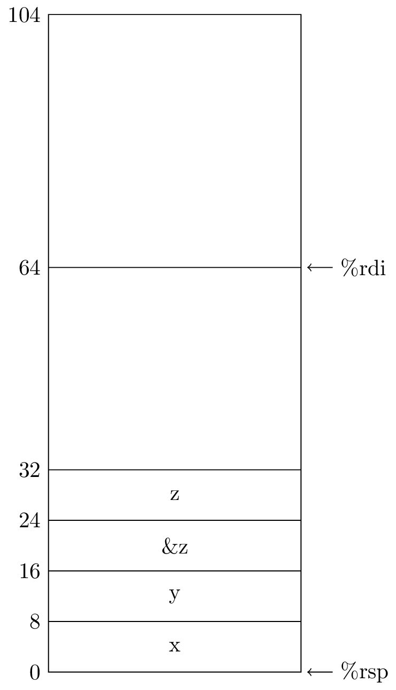
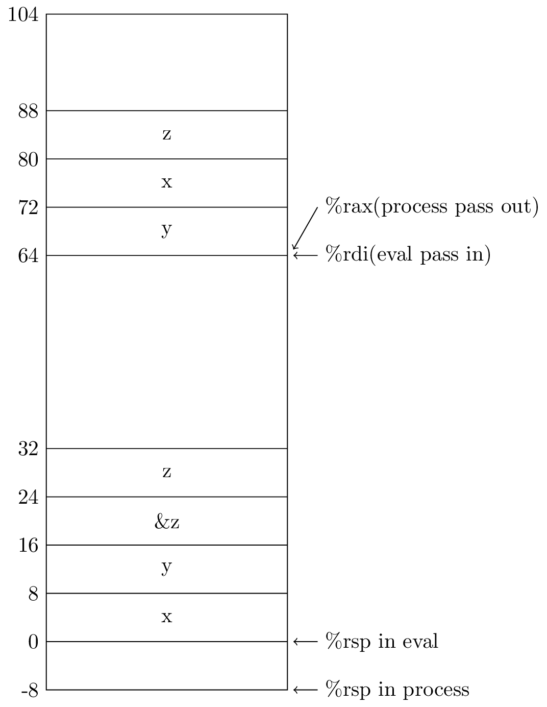

3.67

```c
!INCLUDE "./code/3.67.c"
```

```gas
!INCLUDE "./code/3.67.s"
```

A.



B.

eval pass a new address %rsp+64 to process

C.

process access s by %rsp+offset, not by %rdi

D.

eval pass address %rsp+64 to process, process store data from here as beginning,
finially return this address

E.



F.

caller find space and pass space address to callee, callee store data on this
space area and return this address
