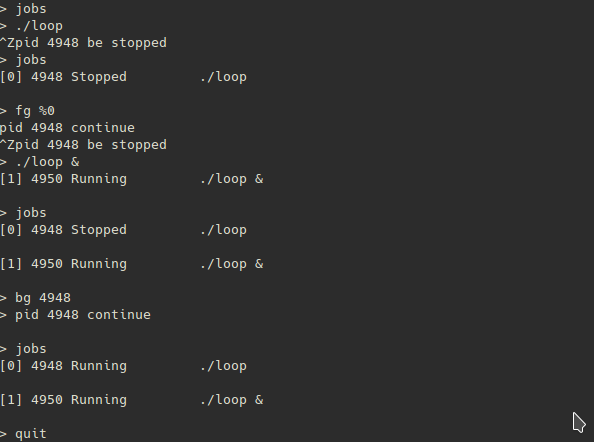

8.26

learn

- origin shell code in pic 8-23, pic 8-24, pic 8-25
- how to use waitpid in pic 8-18
- how to wait child process in pic 8-42

and write a job management module

compose them and the little shell is born.

add `bg` `fg` `jobs` command to origin shell program

```c
!INCLUDE "./code/shell/shell.c"
```

job management module. signal handlers are the key part

```c
!INCLUDE "./code/shell/job.c"
```

test it

    (cd chapter8/code/shell; make && ./shell)

ps: `./loop` is a dead loop program, `./sleep` sleeps 5 secs and exit.




